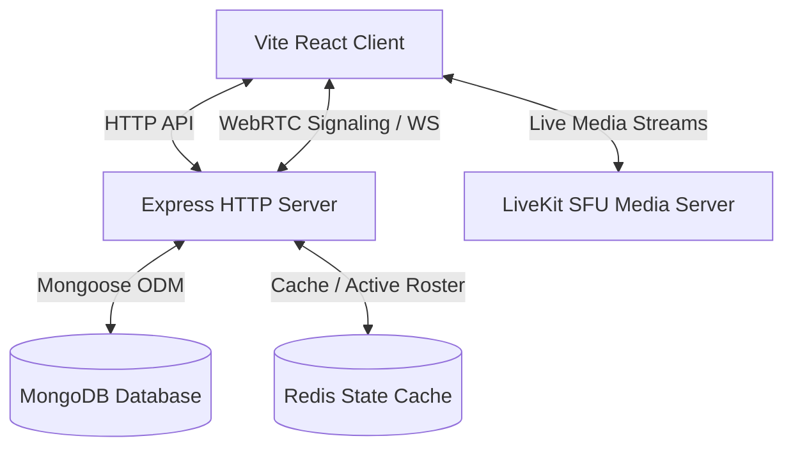

# Enterprise Video Collaboration Workspace

This repository houses the full-stack codebase layout for **Meet-Sphere / Enterprise Workspace**, a high-performance video collaboration suite designed for deep work environments. It balances corporate minimalism with rich glassmorphism aesthetics across a light/dark mode system.

---

## Architecture Overview



- **Front-End**: React (Vite SPA) structured with custom contextual providers (Socket context, LiveKit token contexts) and P2P negotiation hooks (`useWebRTC`).
- **Back-End**: Node.js + Express handling REST API routers (token dispatching), integrated with native `ws` WebSockets to act as a WebRTC signaling router.
- **Media SFU**: LiveKit SDK templates for high-scalability audio/video track publication.
- **Database**: MongoDB storage configured with structured Mongoose schemas for users, scheduled meetings, channels, and documents.
- **Caching**: Redis state stubs for tracking active participant rosters.

---

## Directory Structure

```
├── client/                     # Frontend Vite SPA
│   ├── src/
│   │   ├── components/         # Dashboard, Meetings, LiveKit, Modals
│   │   ├── context/            # WebSocket and LiveKit authentication providers
│   │   ├── hooks/              # Custom hook stubs (useWebRTC, useSocket)
│   │   ├── App.jsx             # Shell controller
│   │   ├── index.css           # Styling system (Deep Slate Adaptive CSS variables)
│   │   └── main.jsx
│   ├── tailwind.config.js
│   └── package.json
└── server/                     # Backend API & Signaling server
    ├── config/                 # Mongoose connections, Redis client, LiveKit helpers
    ├── models/                 # Database Mongoose Schemas (User, Meeting, Channel, Document)
    ├── sockets/                # WebSocket signaling connection handler
    ├── server.js               # Entry point (HTTP + WebSocket upgrades)
    └── package.json
```

---

## Getting Started Locally

### Prerequisites
- [Node.js](https://nodejs.org/) v18+
- [MongoDB](https://www.mongodb.com/) (running instance for database connection)
- [Redis](https://redis.io/) (optional, falling back on connection stub logging)

### 1. Backend Service Configuration
Navigate to the `server/` directory:
```bash
cd server
```
Create a local `.env` configuration file from the template:
```bash
copy .env.example .env
```
Install dependencies and launch the dev environment:
```bash
npm install
npm run start
```
The backend API service will bind to `http://localhost:5000`. WebSocket signaling will run at `ws://localhost:5000/signaling`.

### 2. Frontend Development Server
Navigate to the `client/` directory:
```bash
cd ../client
```
Install dependencies and launch the dev environment:
```bash
npm install
npm run dev
```
Open your browser and navigate to `http://localhost:3000` (or the port specified in terminal).

---

## Signaling & Media Protocols

1. **WebRTC Signaling Protocol**: WebSockets handle the peer handshakes. Clients send `offer`, `answer`, and `candidate` payloads specifying target identities, routed automatically by `sockets/signaling.js`.
2. **SFU Integration**: The frontend connects to the SFU through `components/LiveKitContainer.jsx`, using secure access tokens fetched from `/api/meetings/token` generated by `livekit-server-sdk`.
